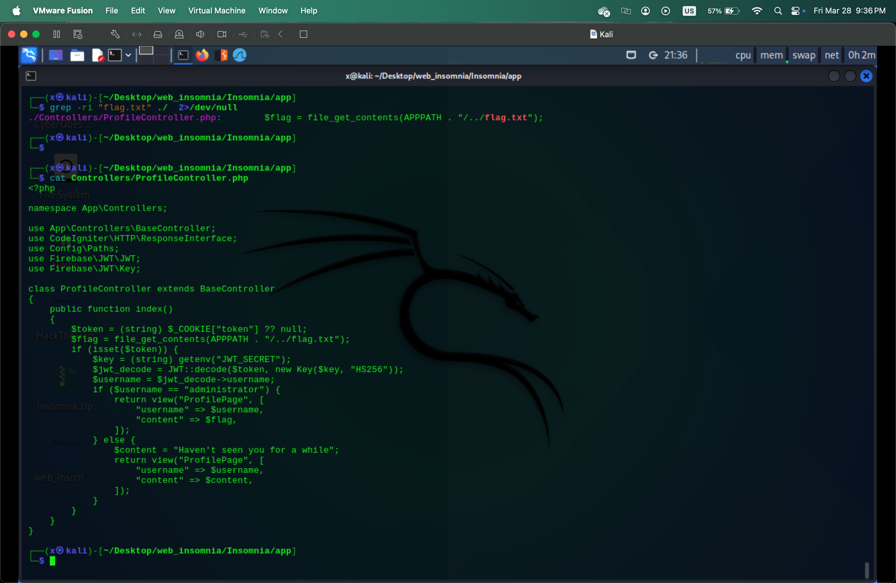
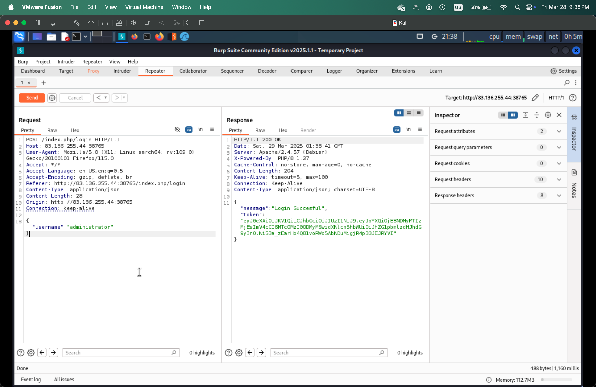

### :dart: SOLUTION :dart:
When we access the website, we try some `SQL Injection` but nothing happend. We need to download the source code of the web, search for `flag.txt` file and we see this `$username == "administrator"`.

Using `BurpSuite` to inspect the web, change `Username` to `administrator` and delete `Password` field. We got `Login Successful!` and the flag.

