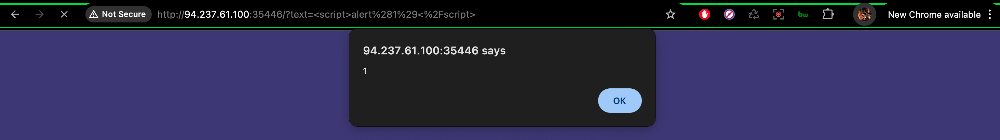
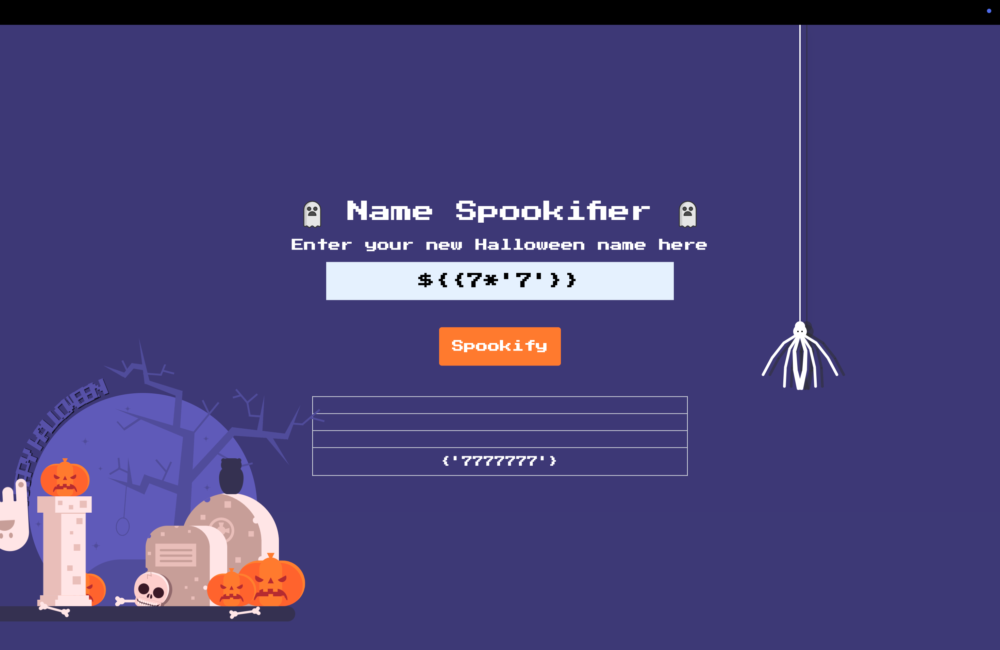
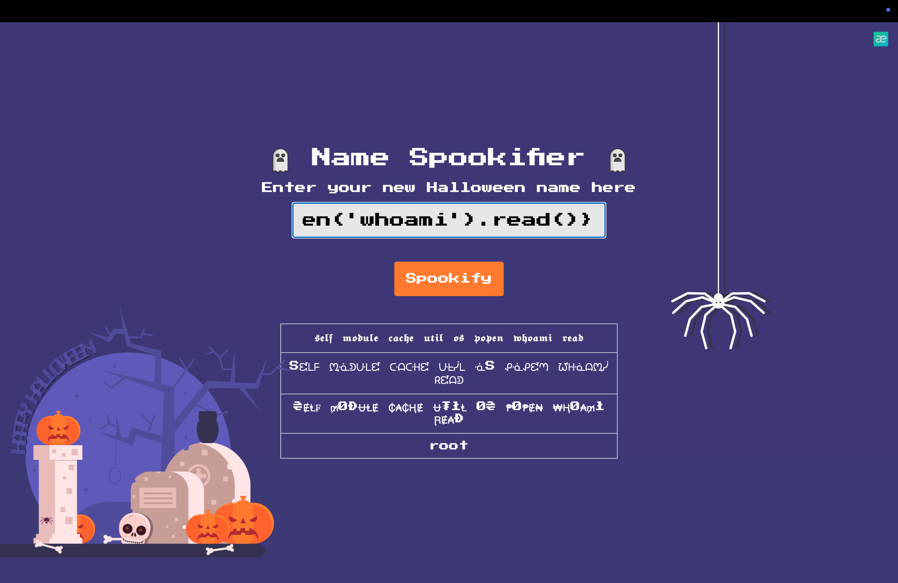
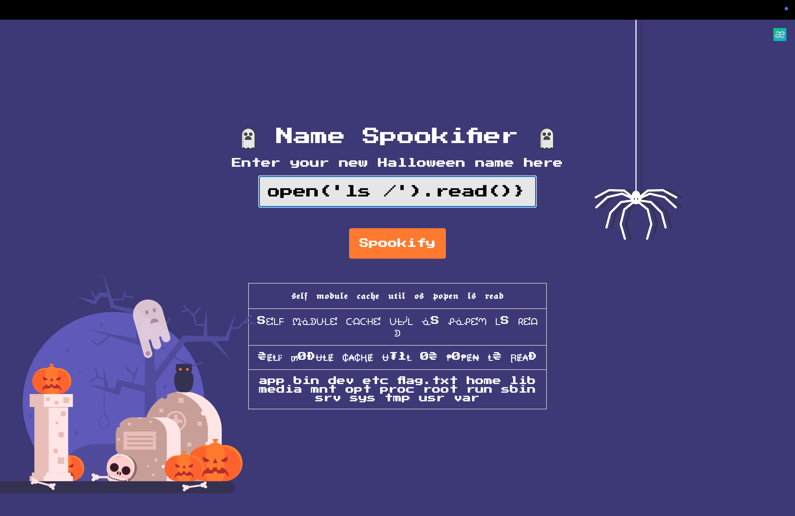

### :dart: SOLUTION :dart:
Firstly, we try XSS to the search bar: `

We can see that it responses. But XSS is used for manipulating the user experience, and there is no user here. So we should another payload (SSTI): `${{7*'7'}}`

We can see it returns `7777777`, so it is a `JINJA2` type, let try this: `${self.module.cache.util.os.popen('whoami').read()}`

We are `root` now, so let find the flag.

