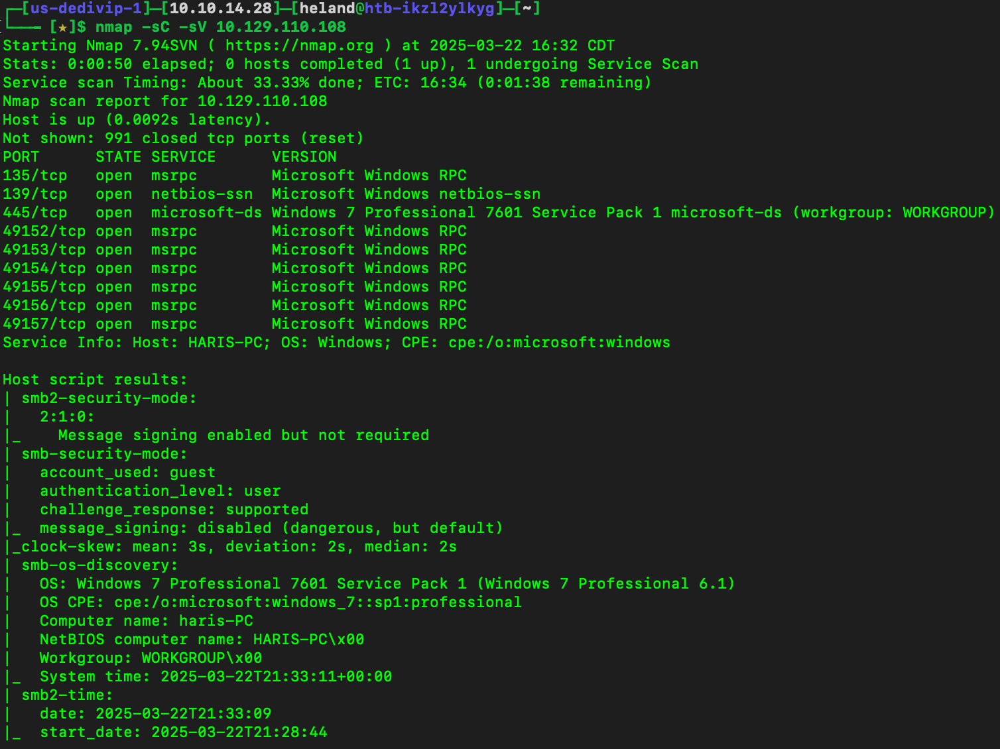
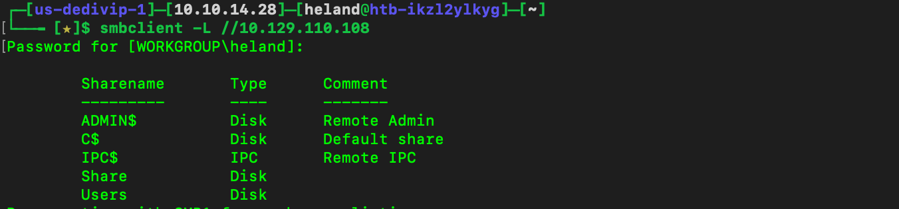
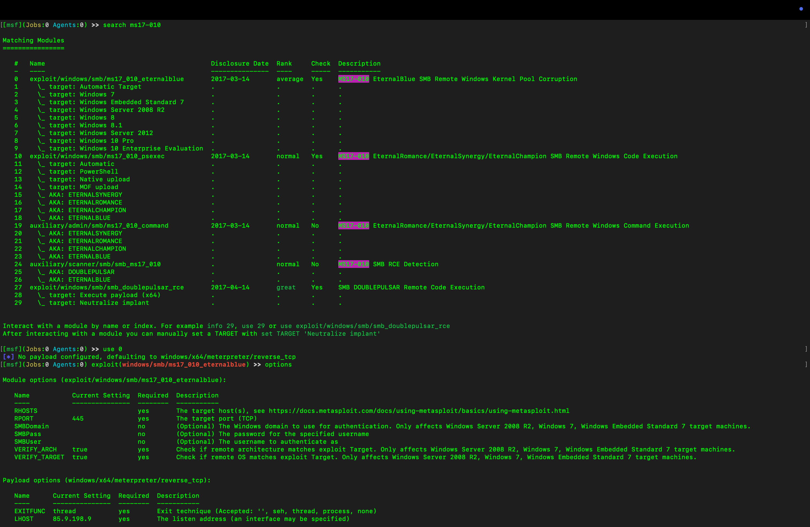
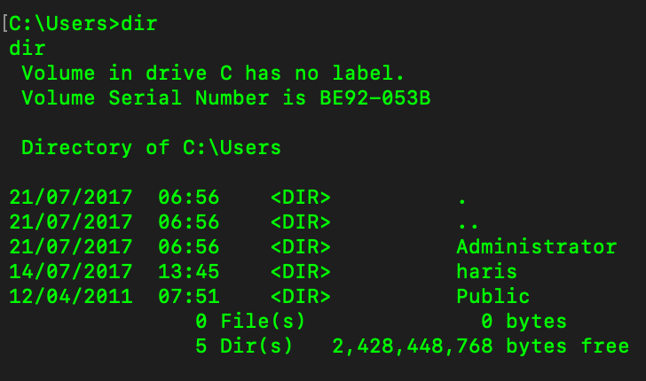

# Writeup
After scanning, we know how many ports are opened, hostname and operating system is running on.

Using `smbclient -L {ip}` to list all SMB shares. 

Search `CVE Windows 17` on Google, we can see the payload. Set `RHOSTS` as target's IP and `LHOST` as attacker's IP, then run.

Using `Meteploits` for exploiting.

