# Writeup
After scaning, we know some ports are opened.
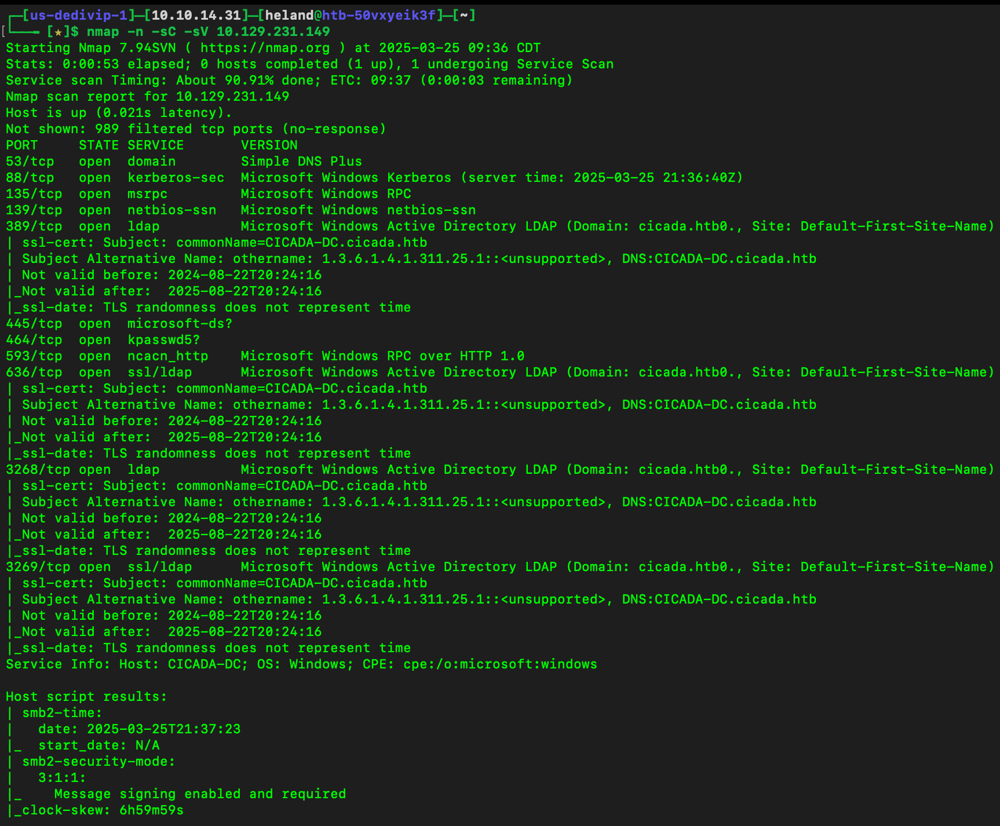
Connect to SMB to see what we have here
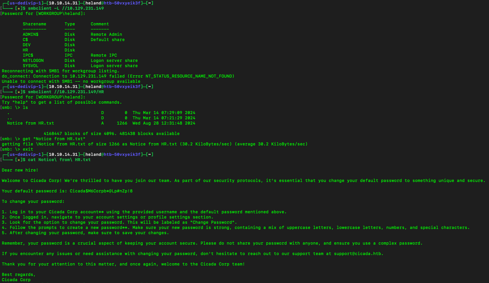
So we see there is a default password, what we need to do is find which user have not changed their password yet. We perform a brute-force attack on the Resource Identifier (RID) to list all users.
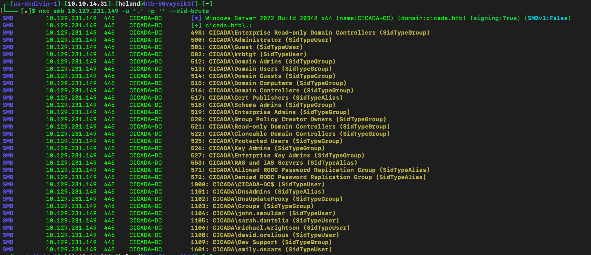
We have a list of username, then use that list and default password to brute force.
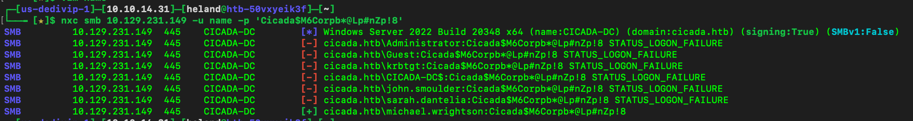
So we see that Micheal has not change his password yet, let see what permission he has here. 
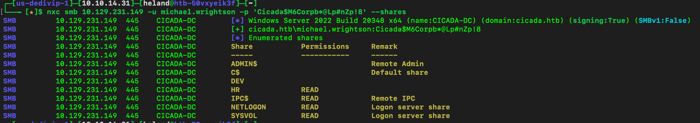
It looks like nothing helpful, so let check Active Directory.
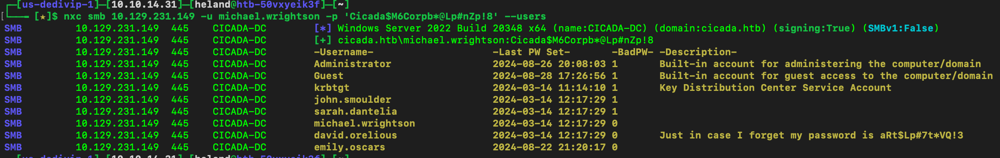
Ohhh, we can someone leaves their password right here.
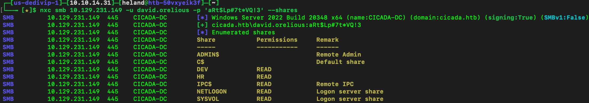
Connect to SMB using David's credential to see what we have
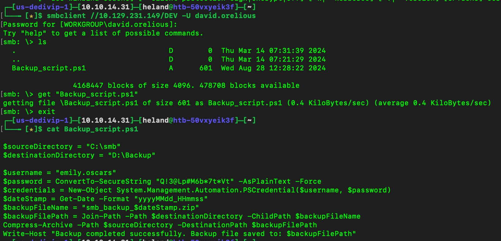
We got Emily's credential, check her permission
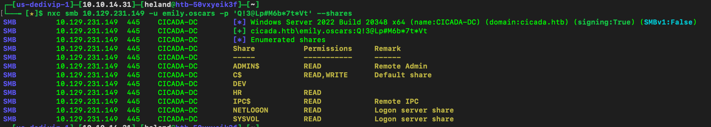
We can see she has access to `C$` and `AMIND$`, we can connect to window by using `evil-winrm`, and get Emily's flag.
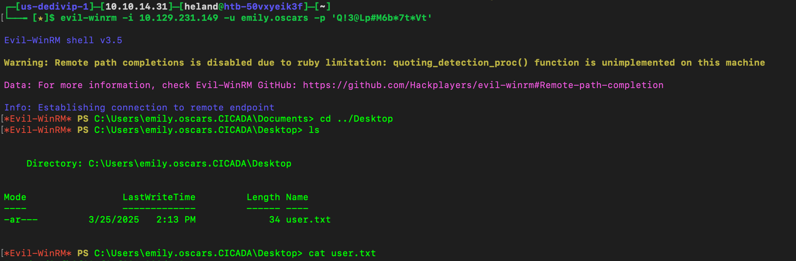
Using `whoami /priv` to see what permission she has. `SeBackupPrivilege` looks interesting.
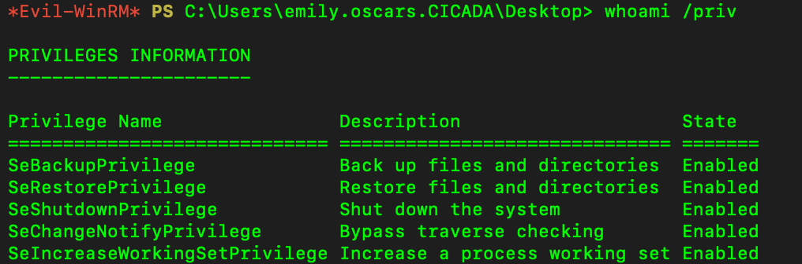
After doing some researchs, we have this command `reg save HKLM\SYSTEM system & reg save HKLM\SAM sam`, download them and crack.
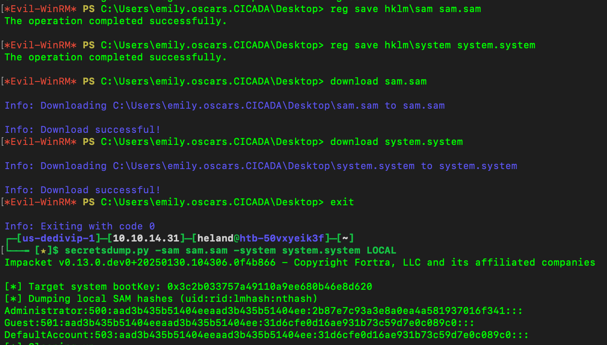
Using pass the hash method and get flag.
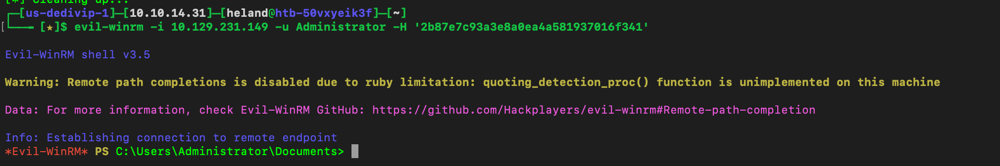
