# Writeup
After scanning, we know how many ports are openned.
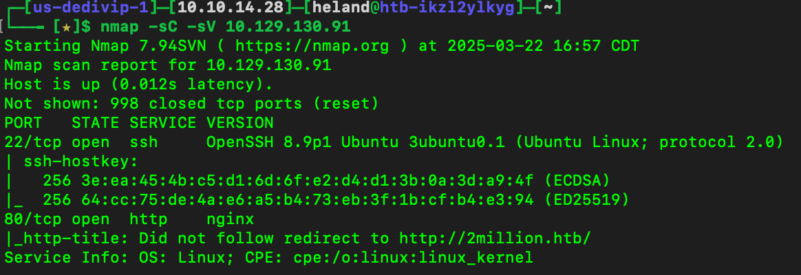

After accessing IP, it redirects us to this domain.
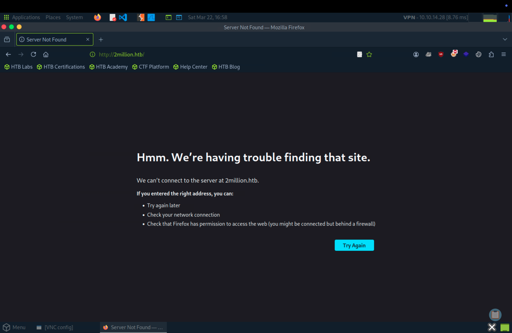

Resolve domain
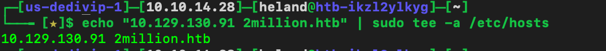

Go to `/invite` page, `F12` to see inspect the code, change to tab `Network` and reload. We can see the JS files here.
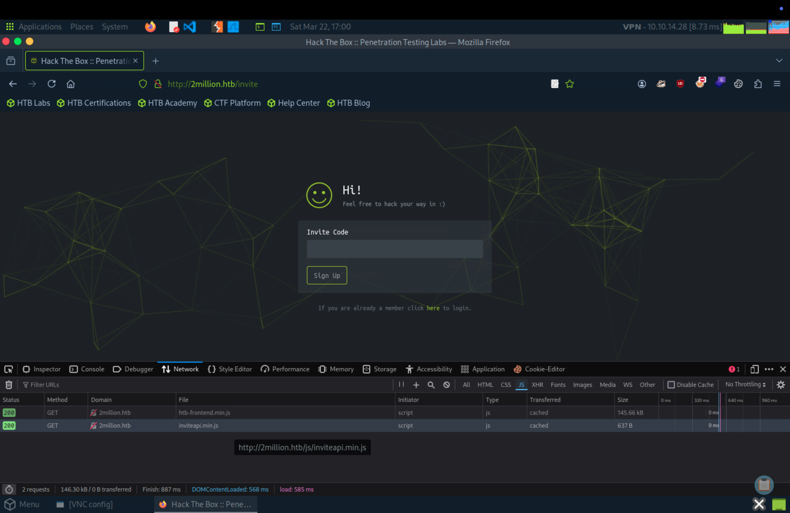

Unpack the JS code, read the code and we will see which function hints about how to get an invite code.
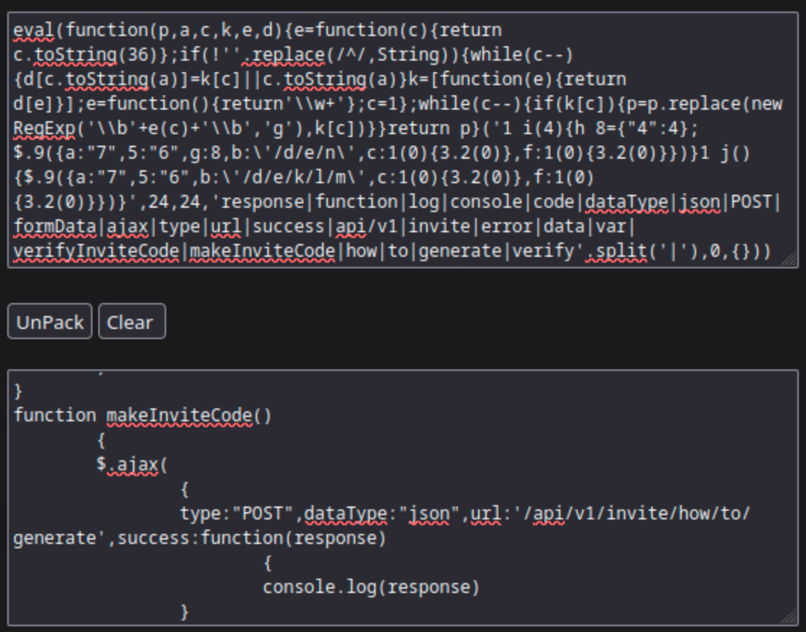

Decrypt and get invite code.
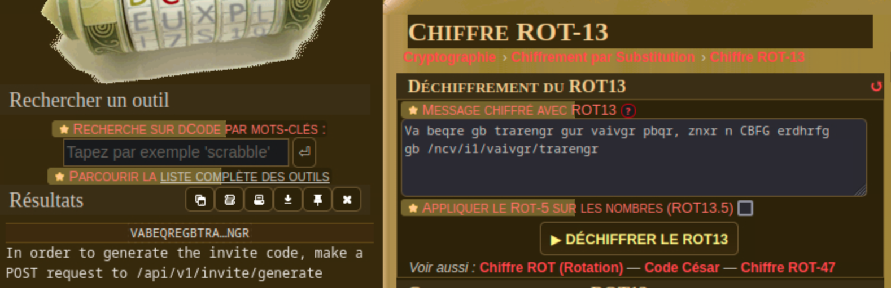
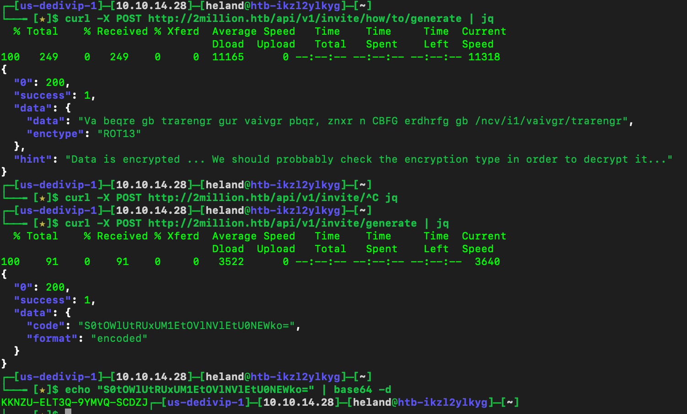

Using `BurpSuite` to check out endpoints that might return a list of endpoints.
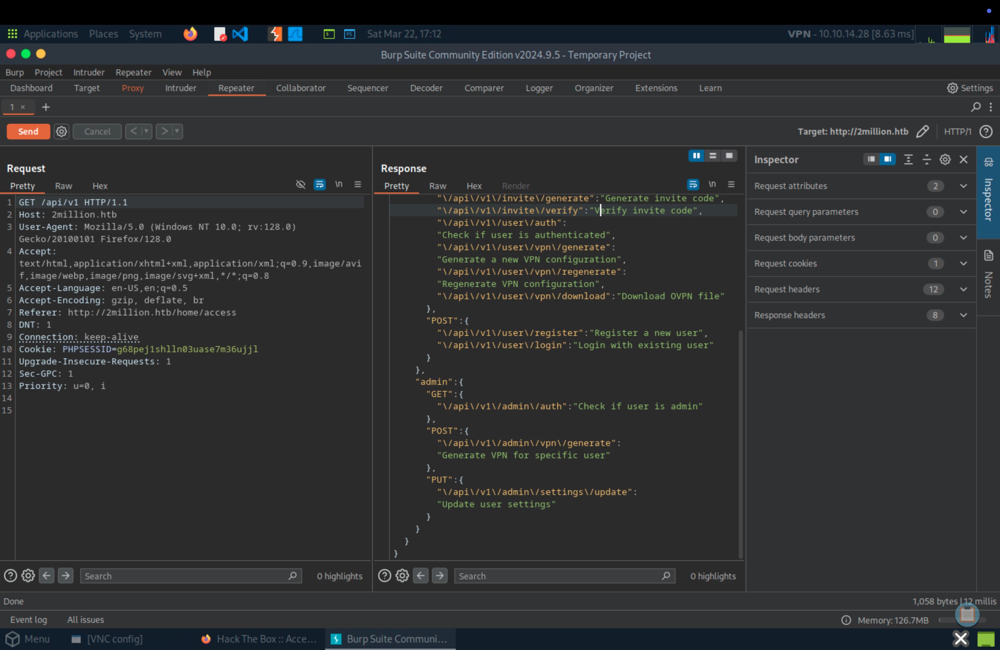

After checking endpoints, we can change the role of our account and inject vulnerable command to `/api/v1/admin/vpn/generate`
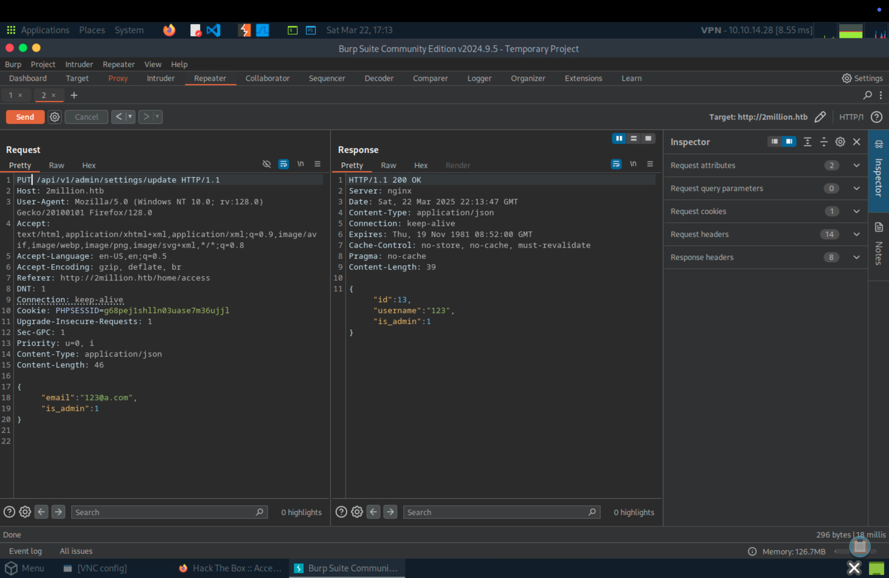
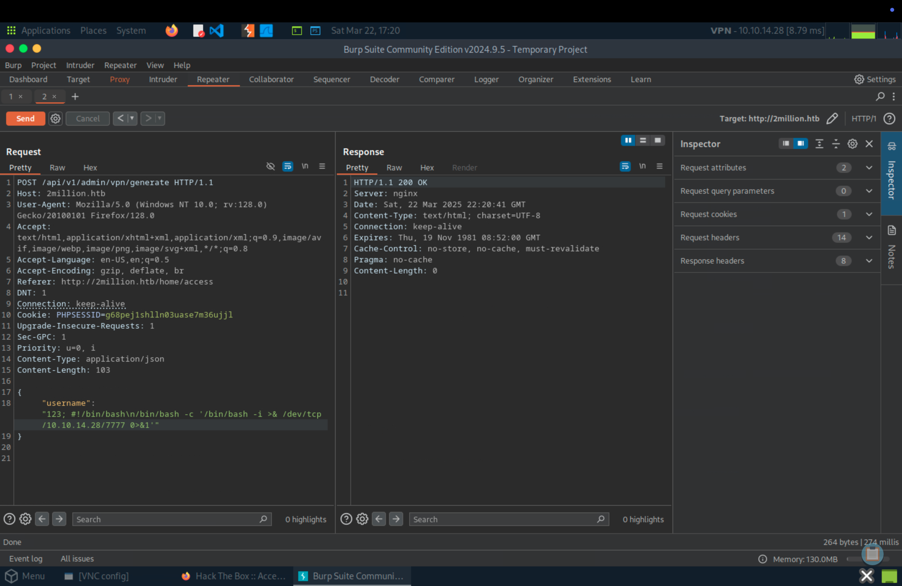

After sending, we can get the shell
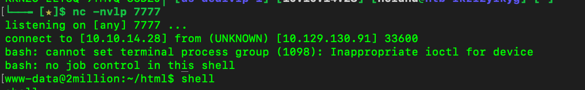

List all files, we can see the hidden file `env`, view the content we can get the password of admin's account. Change to `Admin` user and get flag.

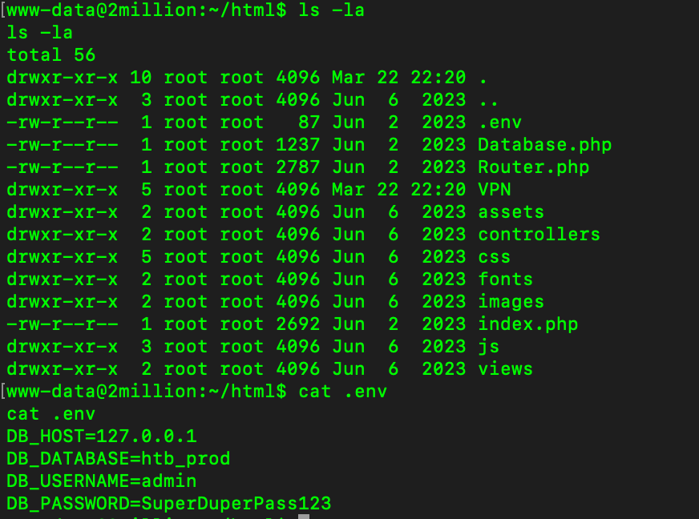
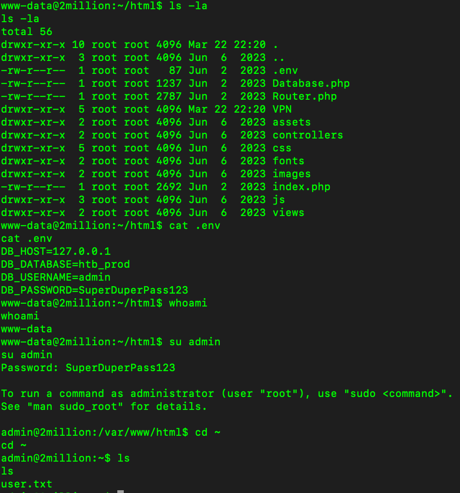

Mail on Linux system is typically stored in one of a few locations.
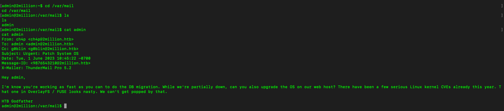

Search `CVE OverlayFS / FUSE` on Google, and we will get the payload file. Download and exploit.
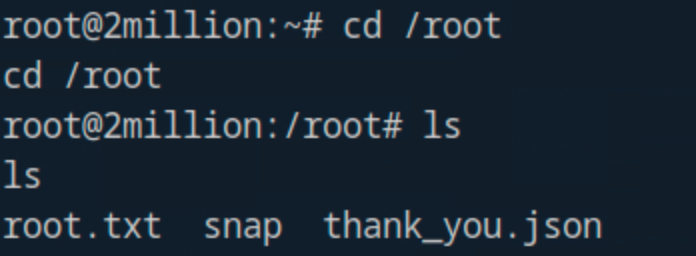

Ref: [CVE-2023-0386](https://github.com/xkaneiki/CVE-2023-0386)
